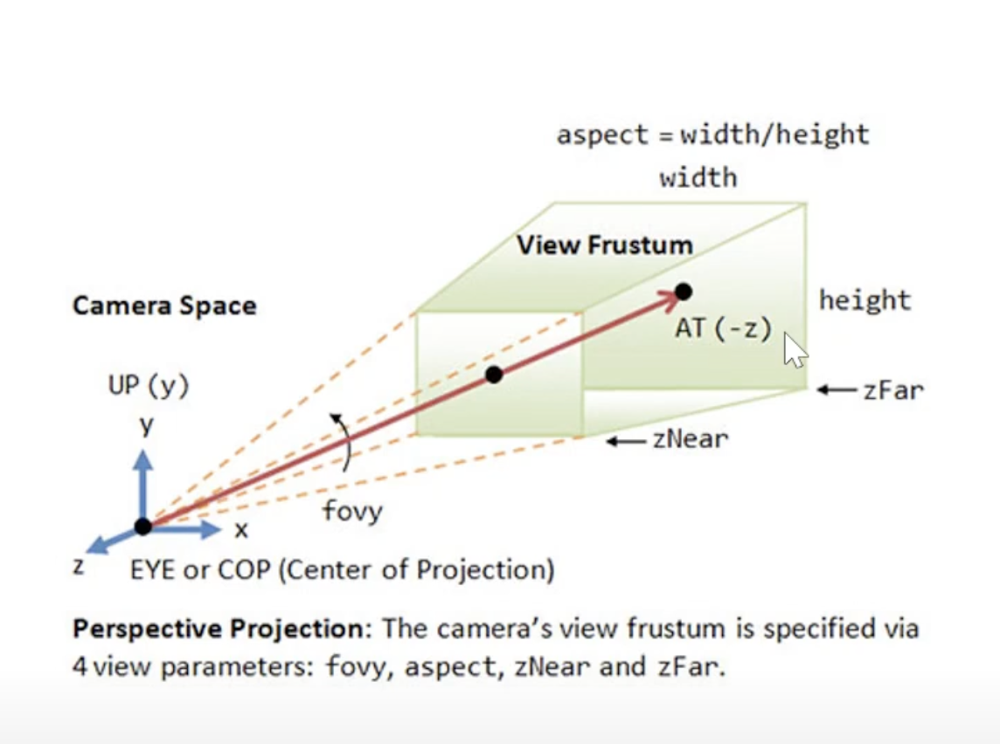
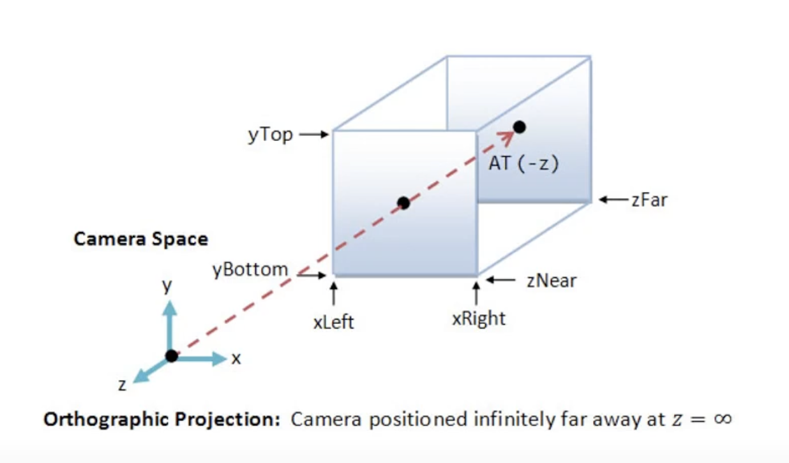
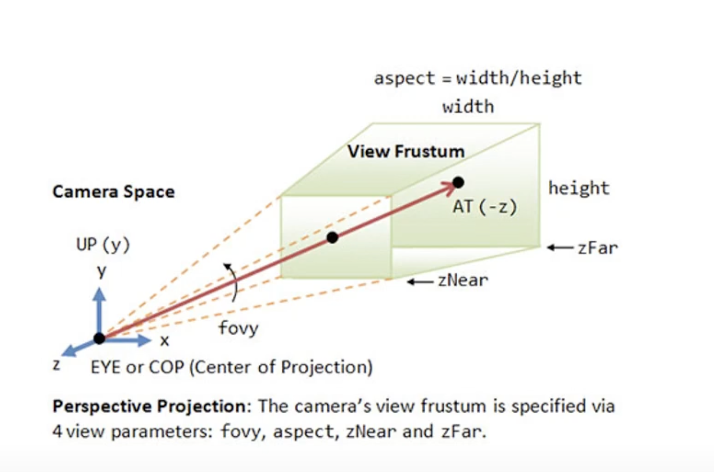
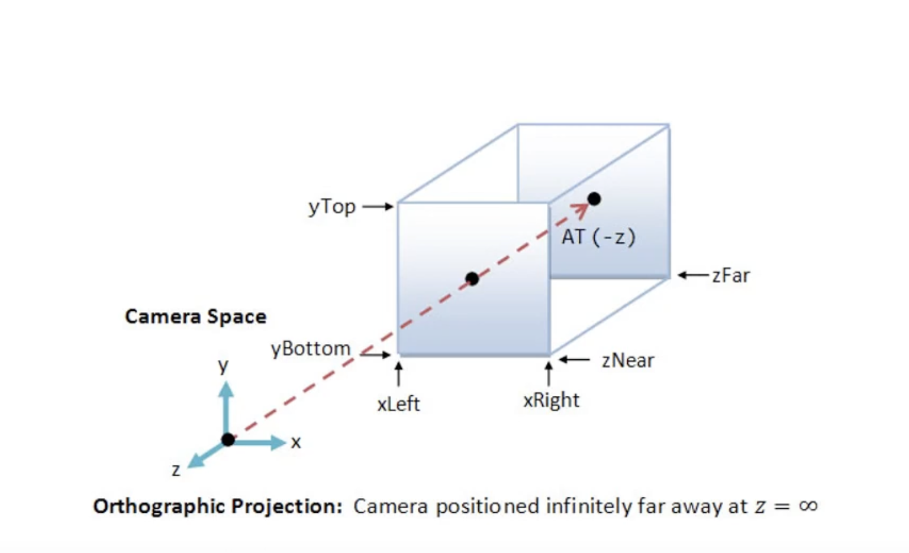

# TODO-LIST

- [x] 변환(Transition)
- [x] 지오메트리(geomatry)
- [x] 재질(material)
- [x] 광원(light)
- [ ] 카메라(camera)
- [ ] 그림자(Shadow)
- [ ] 애니메이션(Animation)
- [ ] 후처리(Postprocessing)

# Light

- AmbientLight(주변광)
- HemisphereLight(주변광,색상2개)
- DirectionalLight(특정 방향으로 향하는 빛)
- PointLight(모든 방향으로 비추는 빛)
- SpotLight(조명광)
- RectAreaLight(형광등처럼 비추는 빛)
- Environment(주위 환경을 촬영한 이미지를 이용한 빛) - Drei에서만 사용가능

# Camera

가장 크게 두개로 나뉜다.

> 공동점은 절두체(Frustum)이다.
> 절두체는 카메라가 보는 화면의 크기를 결정한다.

1. Perspective Camera
   - 원근감을 제공하는 카메라
2. Orthographic Camera
   - 원근감이 없는 카메라

# Perspective Camera

카메라 생성을 위한 파라미터(절두체를 정의하기 위한 값들)

    <li> 화각(Fovy)</**li**> 
    <li> 화면비율(Aspect)</li>
    <li> 절두체에 대한 가장 가까운 거리 (zNear)</li>
    <li> 절두체에 대한 가장 먼 거리 (zFar)</li>

    
    <li>절두체의 XLeft,xRight</li>
    <li>절두체의 yTop,yBottom</li>
    <li>절두체에 대한 가장 가까운 거리 Near</li>
    <li>절두체에 대한 가장 먼 거리 Far</li>

# Orthographic Camera

카메라 생성을 위한 파라미터(절두체를 정의하기 위한 값들)

    <li> 화각(Fovy)</li> 
    <li> 화면비율(Aspect)</li>
    <li> 절두체에 대한 가장 가까운 거리 (zNear)</li>
    <li> 절두체에 대한 가장 먼 거리 (zFar)</li>

    
    <li>절두체의 XLeft,xRight</li>
    <li>절두체의 yTop,yBottom</li>
    <li>절두체에 대한 가장 가까운 거리 Near</li>
    <li>절두체에 대한 가장 먼 거리 Far</li>

# Shadow

### 그림자를 지원하는 광원

- DirectionalLight
- SpotLight
- PointLight

### Drei에서 제공하는 그림자 컴포넌트

- AccumulativeShadowMap
- ContactShadow
- SoftShadows

### Three.js의 그림자 알고리즘

- BasicShadowMap
  - 필터링 없는 그림자 맵을 제공하며 속도는 빠르지만 품질이 나쁨
- PCFShadowMap
  - Percentage-Closer Filtering 알고리즘이 적용된 그림자 맵 생성
- PCFSoftShadowMap
  - 개선된 Percentage-Closer Filtering 알고리즘이 적용된 그림자 맵 생성(R3F의 기본값)
- VSMShadowMap
  - Variance Shadow Map 알고리즘이 적용된 그림자 맵 생성
